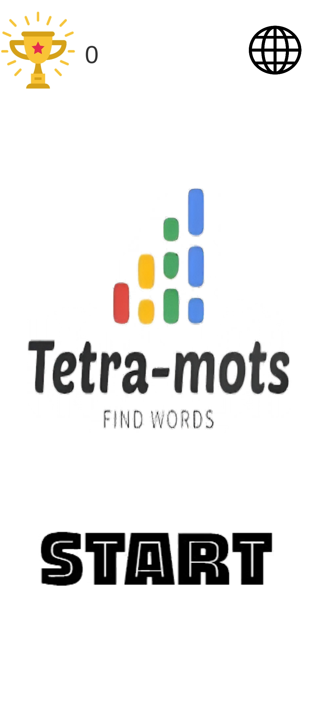
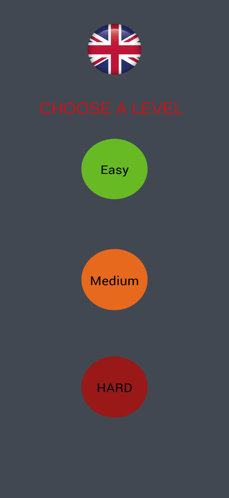
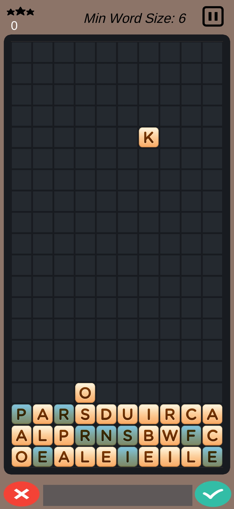
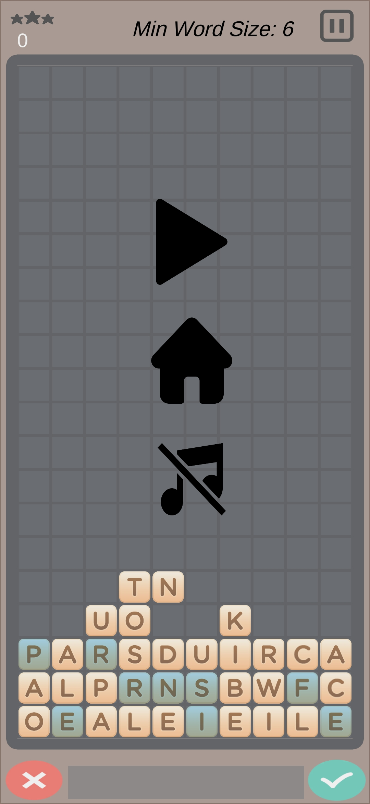

# Tetra-Mots

Tetra-Mots est un jeu hybride entre **Tetris** et **Scrabble**, où les blocs sont remplacés par des lettres.  
Le but est de former des mots valides avec les lettres qui tombent afin de les faire disparaître et d’accumuler des points.  
Le jeu prend fin lorsqu'une lettre dépasse la hauteur de la fenêtre.

## Fonctionnalités

- **Mécaniques de Tetris** : Les lettres tombent du haut de l'écran et s'empilent.
- **Formation de mots** : Sélectionne les lettres adjacentes pour composer un mot.
- **Types de lettres** : Lettres normales et lettres en glace (qui ont une seconde vie).
- **Modes de difficulté** : Trois niveaux (facile, moyen, difficile) influençant la vitesse et les règles du jeu.
- **Langues supportées** : Français et Anglais.
- **Système de score** : Plus le mot est long, plus le score est élevé.
- **Gestion du son** : Musiques et effets sonores activables/désactivables.
- **Interface intuitive** : Menu, pause, écran de fin de jeu.
- **Partage des scores** : Possibilité de partager ses scores sur les réseaux sociaux.

## Installation et exécution

1. **Cloner le dépôt**  
   ```bash
   git clone https://github.com/fayssalzakaria/tetra_words.git
   cd tetra_words
## Ouvrir le projet dans Unity

- Lancer **Unity Hub**  
- Ajouter le projet **Tetra-Mots**  
- Ouvrir la scène principale du jeu  

## Compiler et exécuter

- Sélectionner la plateforme **Android** ou **PC**  
- Générer un build et lancer le jeu  

## Architecture du projet

Tetra-Mots/
├── Assets/
│   ├── Scripts/
│   │   ├── AudioManager.cs
│   │   ├── Board.cs
│   │   ├── DictionaryManager.cs
│   │   ├── GameManager.cs
│   │   ├── LetterCollider.cs
│   │   ├── LevelManager.cs
│   │   ├── LoseManager.cs
│   │   ├── ShareOnSocialMedia.cs
│   │   ├── StartManager.cs
│   │   └── UiManager.cs
│   ├── Scenes/
│   │   ├── Home.unity
│   │   ├── Levels.unity
│   │   ├── Game.unity
│   │   └── Lose.unity
│   ├── Prefabs/
│   ├── Textures/
│   └── Audio/

## 📸 Captures d’écran

### 🏠 Écran d’accueil  


### 🎯 Sélection du niveau  


### 🎮 Écran de jeu  


### ⏸️ Menu pause  



##   Présentation du jeu

[](Demo%20tetra-words.mp4)
##  Auteur  
**Fayssal**  
- Email : fayssal.132004@gmail.com
